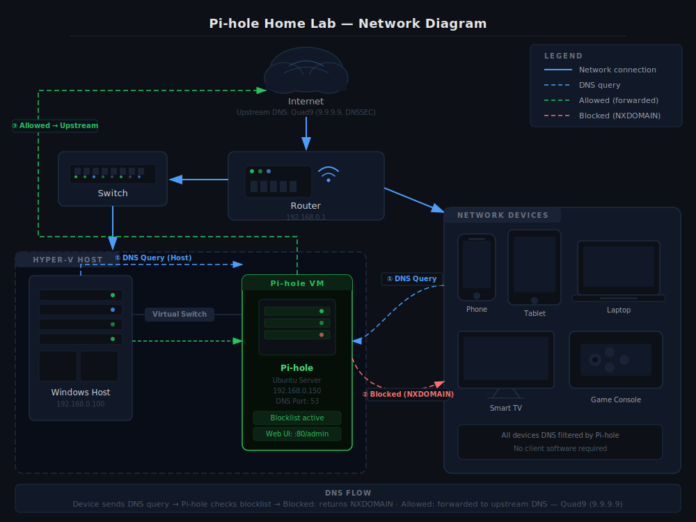
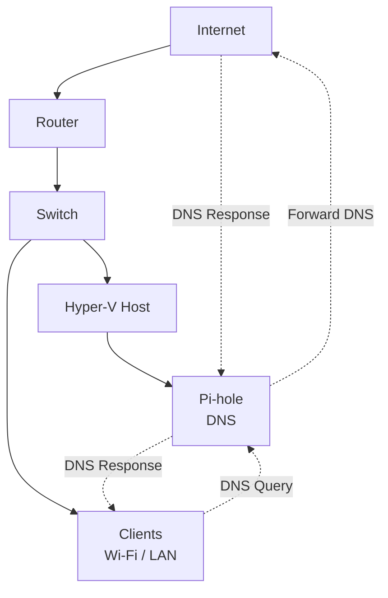

# Network

## IP Plan

| Device | IP Address | Type |
|------|------------|------|
| Router | 192.168.1.1 | Static |
| Windows Server (Hyper-V Host) | 192.168.1.5 | Static |
| Pi-hole VM | 192.168.1.10 | Static |
| Clients (DHCP range) | 192.168.1.20 – 192.168.1.254 | DHCP |

## How DNS Works 
A network router takes care of giving clients their DNS configurations through DHCP. The router will let the clients know about the Pi-hole virtual machine as the main DNS server.

When a client does a DNS query:

1. The client's DNS request is sent to the Pi-hole virtual machine.
2. The Pi-hole checks its local blocklist databases for any records matching the requested domain.
3. If there are no matching records indicating that the domain should be blocked, the Pi-hole then searches its local cache for any cached records (if they exist).
4. If there are no cached records, the Pi-hole forwards the request to its configured upstream DNS resolver (the DNS server(s) specified in the configuration).
5. When responding to the request from the Pi-hole, the upstream DNS resolver will return the response back to the Pi-hole.
6. Finally, the Pi-hole sends the DNS resolution result to the client.

## DHCP
The DHCP service is handled by the router, and the Pi-hole does not serve as a DHCP server.

## Network Assumptions
- There is one LAN network.
- There are no Virtual LANs (VLANs).
- IPv4 is the only protocol being used.
- The Pi-hole has a static IP address.
- The router will only forward any DNS traffic through the Pi-hole.

