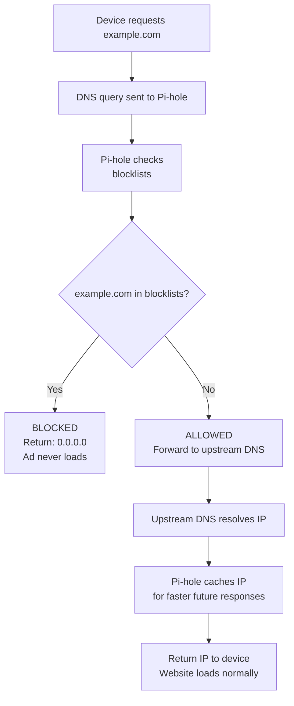

# Pi-hole

## What is Pi-hole?
Pi-hole is a DNS sinkhole that blocks ads and trackers for every device connected to your home network.

## Benefits of Using Pi-hole
- Blocks ads on every device in your network (PCs, Televisions, Gaming Consoles, Mobile Devices)
- Speeds up page loading times on websites
- Provides enhanced privacy by blocking trackers
- Offers a centralized web-based management interface
- Has minimal resource requirements

## Purpose
The primary purpose of this technology is:
- stop tracking ads from loading by intercepting requests for DNS records
- stablish a Private DNS Server for Internet Filtering
- By reducing the amount of time it takes to load ads and serving cache DNS records from the Pi-Hole, you will notice an improvement in your web browsing speed
- Ability to store and retrieve cached DNS records from the Pi-Hole
- Set up parental controls for specific content (e.g., pornographic material)
- For some devices (e.g., gaming consoles, smart televisions, etc.), traditional ad-blockers are difficult to install; however, the Pi-hole provides the ability to block ads on these types of devices automatically using the same method used to block advertisements on your personal computer. 

## How Pi-hole serves the Network?

## Block Lists
The primary block lists that the Pi-hole uses to filter DNS requests are the open-source community maintained lists of known advertisement and tracking domains. 
Users may also manually add additional domains if needed.
