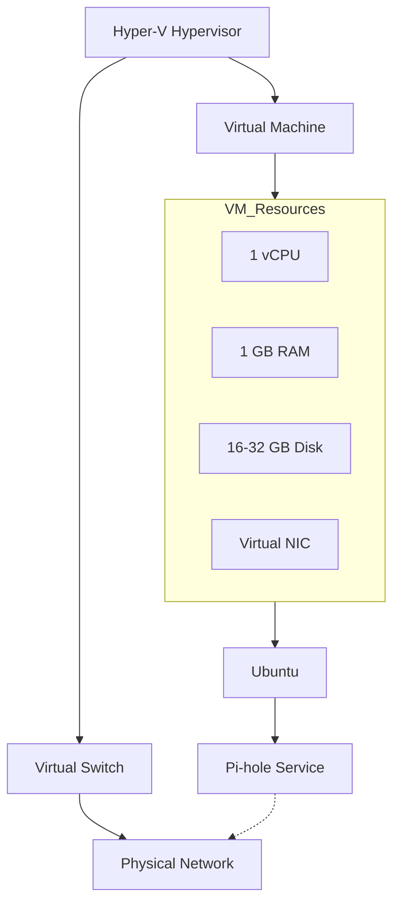

# Virtualization

## Virtualization Architecture

## Virtual Machine Specifications
| Component | Specification |
|-----------|---------------|
| **VM Name** | pihole-vm |
| **Hypervisor** | Hyper-V (Type 1) |
| **Guest OS** | Ubuntu Linux |
| **vCPU** | 1 core |
| **RAM** | 1 GB |
| **Storage** | 16-32 GB virtual disk |
| **Network** | Virtual NIC → Virtual Switch |
| **Services** | Pi-hole DNS |
| **IP Address** | 192.168.1.10 |
## Hyper-V Host

- Operating System: Windows Server
- Hypervisor: Hyper-V
- Role: The host for the Pi-hole virtual machine
## Prerequisites

### Source
Requirements are based on the official [Pi-hole Documentation](https://docs.pi-hole.net/main/prerequisites/).

### Hardware Requirements
- **Disk Space**: Minimum 2GB, 4GB recommended
- **RAM**: Minimum 512MB
- **CPU**: Any modern processor (very lightweight)

*Note: These are the minimum requirements from Pi-hole. For our VM, we'll allocate more resources.*

## How to create VM and V-Switch
The Pi-hole virtual machine and the virtual switch are created using a PowerShell script.

- [Create External Virtual Switch](../scripts/create-v-switch.ps1)
- [Create Pi-hole Virtual Machine](../scripts/create-pihole-vm.ps1)

These scripts automate the Hyper-V configuration and ensure a consistent setup.

